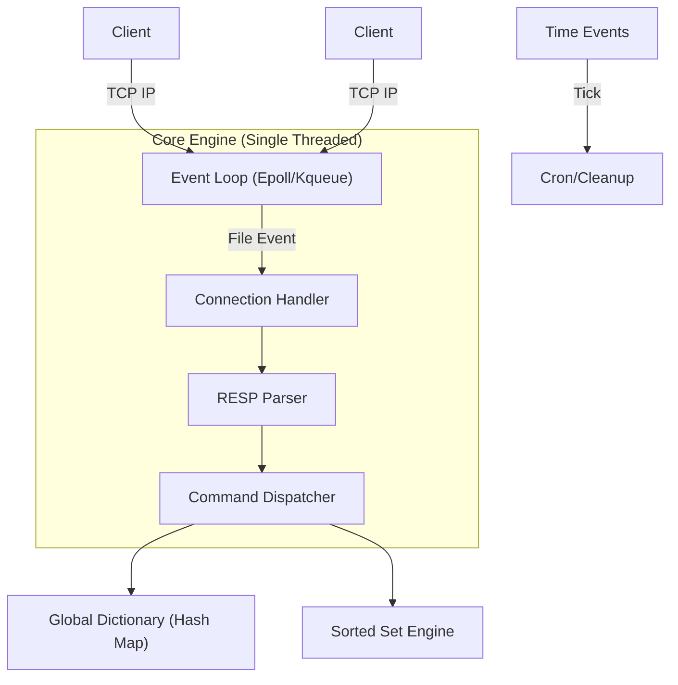

# RedisClone


**RedisClone** is a high-performance, single-threaded, Redis-compatible Key-Value store implemented in Go. It replicates the core architecture of Redis to achieve high throughput and low latency, handling over **50,000 operations per second** on a single thread.

This project was built to explore operating system internals, specifically non-blocking I/O, event loops, and efficient data structures.

## 🚀 Key Features

-   **I/O Multiplexing**: Implements a custom event loop using `syscall.EpollWait` (Linux) and `syscall.Kqueue` (macOS) to handle thousands of concurrent connections (C10k ready).
-   **Redis Protocol (RESP)**: 100% compatible with existing Redis clients (redis-cli, Jedis, go-redis).
-   **Data Structures**: 
    -   **Strings**: Binary-safe string storage.
    -   **Hash Maps**: Incremental resizing for strict $O(1)$ performance.
    -   **Sorted Sets (ZSET)**: Implementation of **SkipList** for $O(\log N)$ range queries and ranking.
-   **Persistence**: AOF (Append Only File) persistence (optional configuration).
-   **TTL**: Key expiration and eviction strategies (LRU approximation).

## ⚡ Performance

Benchmarks conducted on a local development environment (Intel Core i7-10750H) demonstrate performance comparable to standard Redis for supported commands.

| Metric | Throughput | Latency (Avg) |
| :--- | :--- | :--- |
| **GET** | ~49,000 ops/sec | 20 µs |
| **SET** | ~44,500 ops/sec | 22 µs |

*Verified using `redis-benchmark -t set,get -n 100000 -c 50`.*

### Load Testing
Under high concurrency (200+ virtual users), the server maintains stability with P95 latency ~129ms.

## 🛠 Architecture

The architecture mimics the single-threaded event loop design of Redis:



## 📦 Getting Started

### Prerequisites
-   Go 1.21+
-   Docker (optional)

### Building Locally

```bash
# Clone the repository
git clone https://github.com/Mazukiri/RedisClone.git
cd RedisClone

# Build the binary
make build

# Run the server
make run
```

The server listens on `0.0.0.0:8082` by default.

### Running with Docker

```bash
docker build -t redis-clone .
docker run -p 8082:8082 -p 9090:9090 redis-clone
```

## 🧪 Testing

```bash
# Run unit tests
make test

# Run benchmarks
make bench
```

## 🤝 Usage with Redis CLI

You can connect using the standard `redis-cli`:

```bash
redis-cli -p 8082
127.0.0.1:8082> SET mykey "Hello World"
OK
127.0.0.1:8082> GET mykey
"Hello World"
```

## 📄 License
MIT
